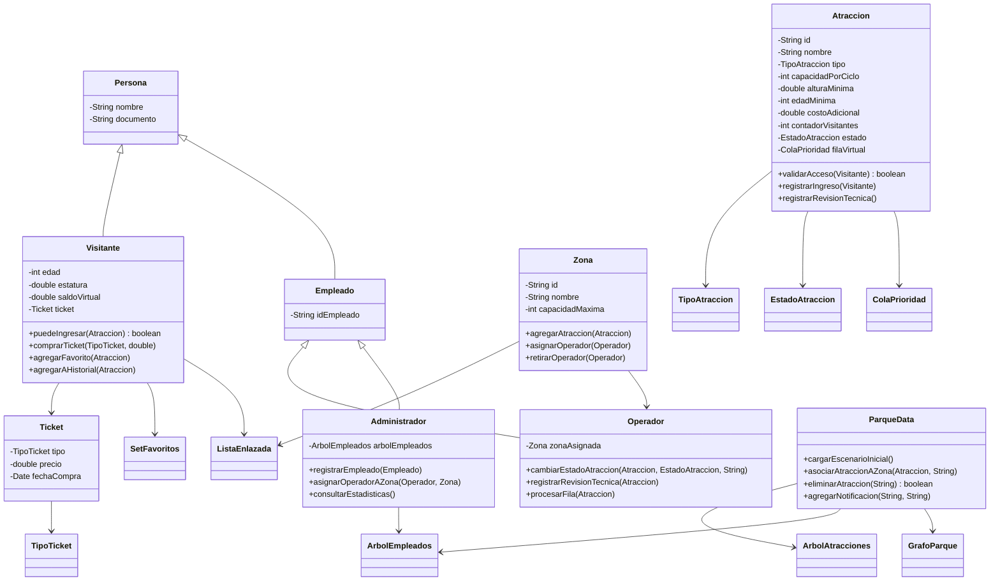

# Diagrama de clases - TechPark UQ

```mermaid
classDiagram
  Persona <|-- Visitante
  Persona <|-- Empleado
  Empleado <|-- Operador
  Empleado <|-- Administrador

  Visitante --> Ticket
  Ticket --> TipoTicket
  Visitante --> SetFavoritos
  Visitante --> ListaEnlazada
  Zona --> ListaEnlazada
  Zona --> Operador
  Atraccion --> TipoAtraccion
  Atraccion --> EstadoAtraccion
  Atraccion --> ColaPrioridad
  Administrador --> ArbolEmpleados
  ParqueData --> ArbolAtracciones
  ParqueData --> ArbolEmpleados
  ParqueData --> GrafoParque

  class Persona {
    -String nombre
    -String documento
  }

  class Visitante {
    -int edad
    -double estatura
    -double saldoVirtual
    -Ticket ticket
    +puedeIngresar(Atraccion) boolean
    +comprarTicket(TipoTicket, double)
    +agregarFavorito(Atraccion)
    +agregarAHistorial(Atraccion)
  }

  class Empleado {
    -String idEmpleado
  }

  class Operador {
    -Zona zonaAsignada
    +cambiarEstadoAtraccion(Atraccion, EstadoAtraccion, String)
    +registrarRevisionTecnica(Atraccion)
    +procesarFila(Atraccion)
  }

  class Administrador {
    -ArbolEmpleados arbolEmpleados
    +registrarEmpleado(Empleado)
    +asignarOperadorAZona(Operador, Zona)
    +consultarEstadisticas()
  }

  class Atraccion {
    -String id
    -String nombre
    -TipoAtraccion tipo
    -int capacidadPorCiclo
    -double alturaMinima
    -int edadMinima
    -double costoAdicional
    -int contadorVisitantes
    -EstadoAtraccion estado
    -ColaPrioridad filaVirtual
    +validarAcceso(Visitante) boolean
    +registrarIngreso(Visitante)
    +registrarRevisionTecnica()
  }

  class Zona {
    -String id
    -String nombre
    -int capacidadMaxima
    +agregarAtraccion(Atraccion)
    +asignarOperador(Operador)
    +retirarOperador(Operador)
  }

  class Ticket {
    -TipoTicket tipo
    -double precio
    -Date fechaCompra
  }

  class ParqueData {
    +cargarEscenarioInicial()
    +asociarAtraccionAZona(Atraccion, String)
    +eliminarAtraccion(String) boolean
    +agregarNotificacion(String, String)
  }
```
