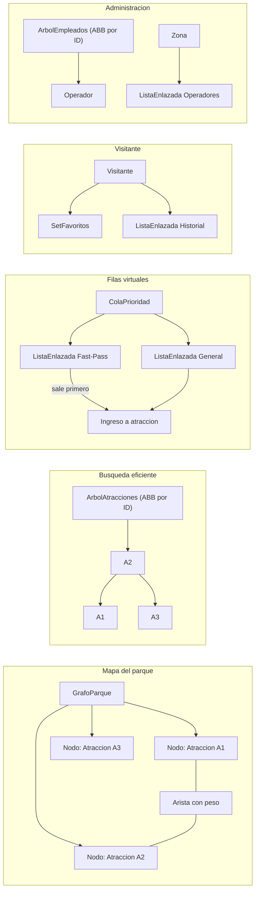

# Diagrama de estructuras propias - TechPark UQ

## Uso en el sistema

- `GrafoParque`: representa atracciones como nodos y senderos como aristas ponderadas. Calcula ruta con Dijkstra.
- `ColaPrioridad`: separa visitantes `FAST_PASS` y `GENERAL`; procesa primero los Fast-Pass.
- `ListaEnlazada`: se usa para operadores por zona, historial de visitas y soporte interno de colas.
- `ArbolAtracciones`: permite buscar atracciones por ID de forma eficiente.
- `ArbolEmpleados`: organiza empleados para gestion jerarquica.
- `SetFavoritos`: evita favoritos repetidos para cada visitante.
